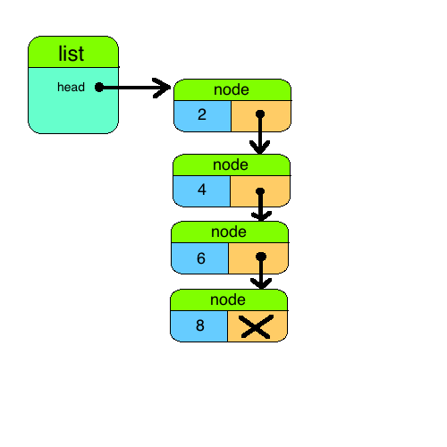

# Linked Lists
## A TDD Experience

### Conceptual Overview

A `linked list` is a data structure of storing a collection items. To start a `linked list` is a collection of nodes, and each `node` has a `value` and a *referenece* to the `next` node. This links each node together through a chain of references. The linked list only needs to store the first node in the chain to maintain the collection of nodes.

### How to make one?

What ingredients do we need from description above?

* `List`: a class to model linked lists
	* `List::Node` a class to link values to gether
		* `value`: a value associated with the node
		* `next`: a reference to the next node  
    * `List#head`: a reference to the first node in the list.
    
 
 > Note: we are using a separate node class to link each item in the list together. This makes defining the `tail` of the list essentially a copying exercise into a new list.
 
### Goal

Get all the specs passing for each spec in the following order:

* `list_node_spec.rb` 
* `list_basic_spec.rb`
* `list_insertion_spec.rb`
* `list_iterators_spec.rb`
* `list_extra_spec.rb`

